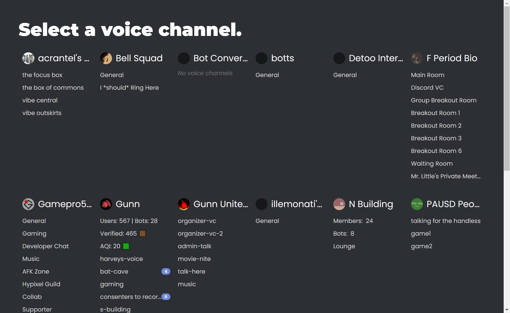
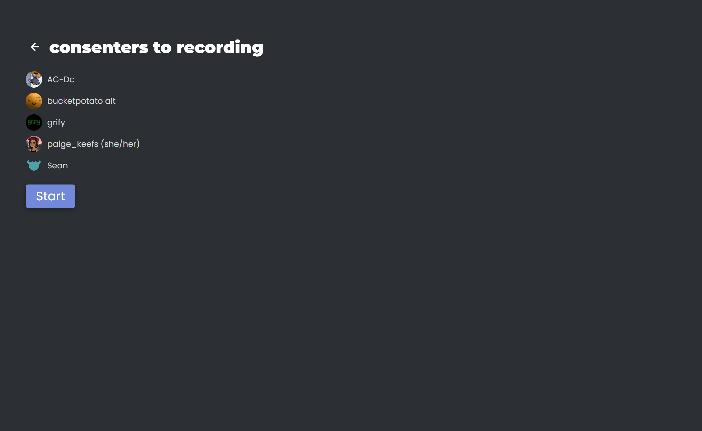
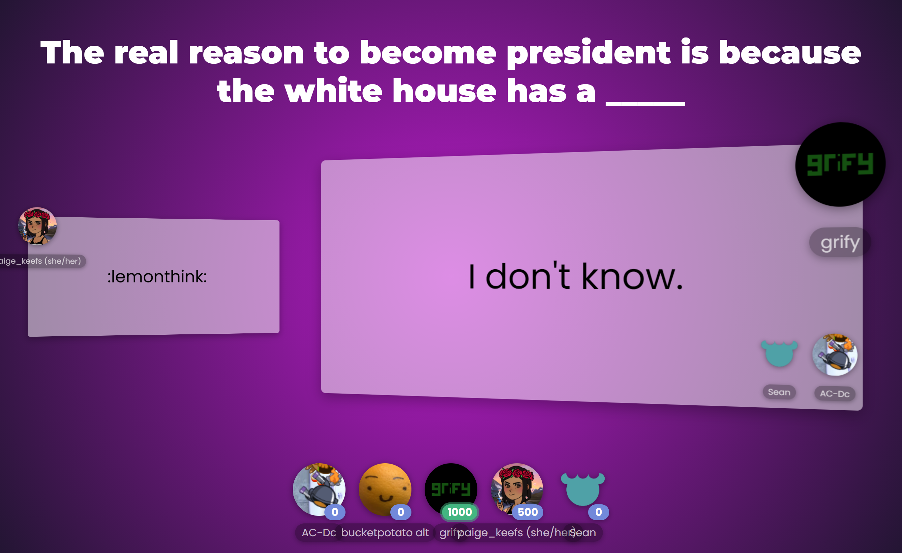
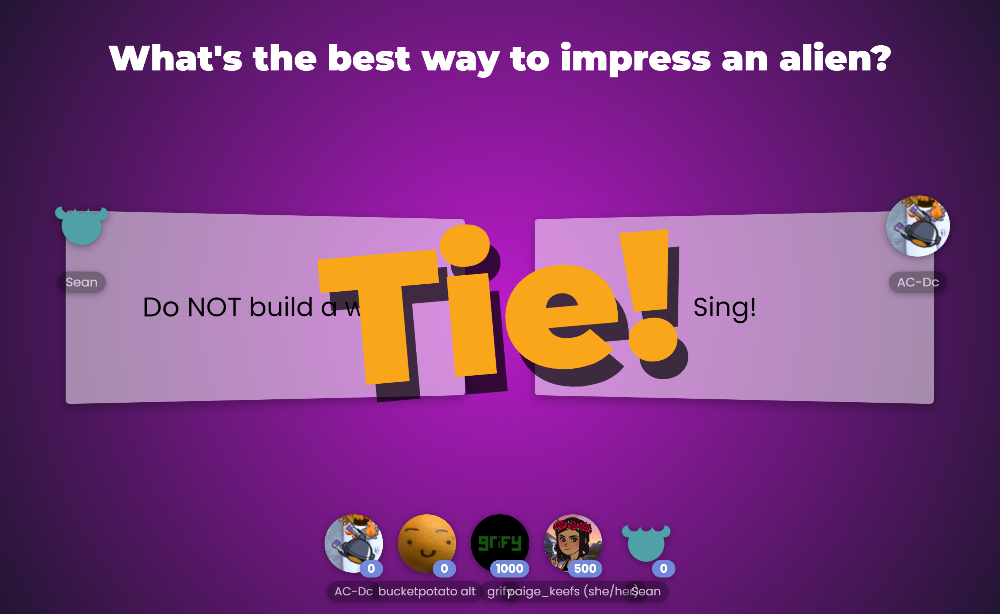

# gunnhacks-lol

Jackbox for Discord, for GunnHacks 7.0.

This works without a backend server (i.e. it can be hosted on GitHub Pages) by
running a Discord bot in the browser using the old web builds of
[discord.js](https://discord.js.org/).

Note, however, that Discord is unfortunately deprecating their discordapp.com
domain in favour of discord.com, with tighter Cloudflare restrictions that
prevent browsers from running Discord bots.

1. Go to https://sheeptester.github.io/gunnhacks-lol/

2. Get your Discord bot token. If you don't have one from an existing bot, you
should [follow this
tutorial](https://discordjs.guide/preparations/setting-up-a-bot-application.html#creating-your-bot)
to make a new bot application and get its bot token. Make sure your Discord bot
is in a server with a voice channel.

3. Paste it into the password input in this screen. You can optionally select to
save the token in localStorage for your convenience.

4. Select a voice channel in a server that your bot is in.

5. You'll be presented with a list of the players for the game. Click "Start"
when everyone is ready.

6. During the first 90 seconds, the bot DMs participants prompts, and
participants respond with their answers.

7. After the prompts have been responded to, people can vote for the better
response.

8. After 15 seconds of voting, the results will be presented, and points will be
awarded per vote.

9. At the end of the game, a scoreboard quantitatively compares the
participants' scores.

